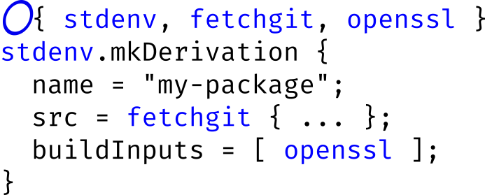
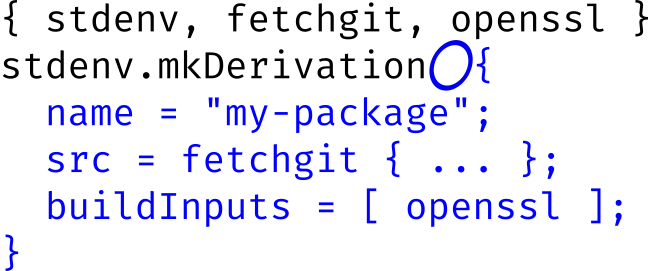
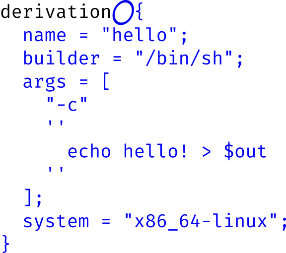

<!--
$size: 16:9
page_number: true

footer: @grhmc github.com/grahamc
-->

<style>
 .hidden { visibility: hidden; }
</style>

# Overrides: In and Out

---

## Overrides are part of the package definition tooling for Nixpkgs.

<div class="hidden">

# ... and they let you tweak some behaviors and parameters without changing Nixpkgs.

</div>

---

## Overrides are part of the package definition tooling for Nixpkgs.
# ... and they let you tweak some behaviors and parameters without changing Nixpkgs.

---

* # overide
* # overrideAttrs
* # overrideDerivation

---

## Defining a package


```nix
{ stdenv, fetchurl, librsync }:
stdenv.mkDerivation rec {
  pname = "btar";
  version = "1.1.1";

  src = fetchurl {
    url = "http://example.com/btar/${pname}-${version}.tar.gz";
    sha256 = "0miklk4bqblpyzh1bni4x6lqn88fa8fjn15x1k1n8bxkx60nlymd";
  };

  buildInputs = [ librsync ];

  installPhase = "make install";
}
```
---


# override


#### Overrides

```nix
█ { stdenv, fetchurl, librsync }:
  stdenv.mkDerivation rec {
    pname = "btar";
```

#### Example:

```nix
pkgs.btar.override {
  librsync = pkgs.my-other-librsync;
}
```

---

# override

#

---

# override

### good for

## Replacing or patching dependencies
## Turning on special flags for some packages

---

# overrideAttrs

#### Overrides

```nix
  stdenv.mkDerivation rec {
█   pname = "btar";
█   version = "1.1.1";
█
█   [---snip---]
█
█   installPhase = "make install";
}
```

#### Example

```nix
pkgs.btar.override (oldAttrs: {
  installPhase = "${oldAttrs.installPhase} PREFIX=$out";
})
```

---

# overrideAttrs



---

# overrideAttrs

###  Good for:
## Changing the source
## Adding patches
## Changing build flags

---

## overrideAttrs: patches

```nix
pkgs.btar.override (oldAttrs: {
  patches = oldAttrs.patches ++ [
    ./example.patch
  ];
})
```

---

## overrideDerivation

```plain
$ nix show-derivation nixpkgs.btar
```

```json
{
  "/nix/store/xr...rw-btar-1.1.1.drv": {
    "outputs": {
      "out": { "path": "/nix/store/va...r9-btar-1.1.1" }
    },
    "inputDrvs": {
      "/nix/store/fv...w3-btar-1.1.1.tar.gz.drv": [ "out" ],
      "/nix/store/rh...6a-librsync-0.9.7.drv": [ "out" ]
    },
    "platform": "x86_64-linux",
    "builder": "/nix/store/il...ah-bash-4.4-p23/bin/bash",
    "args": [ "-e", "/nix/store/9k...5b-default-builder.sh" ],
    "env": {
      "buildInputs": "/nix/store/b3...k2-librsync-0.9.7",
      "builder": "/nix/store/il...ah-bash-4.4-p23/bin/bash",
      "installPhase": "make install PREFIX=$out",
      "name": "btar-1.1.1",
      "out": "/nix/store/va...r9-btar-1.1.1",
      "outputs": "out",
      "src": "/nix/store/qd...hy-btar-1.1.1.tar.gz",
      "stdenv": "/nix/store/v2...xz-stdenv-linux",
      "system": "x86_64-linux"
    }
  }
}
```

---

## overrideDerivation

#

---

## overrideDerivation: Example

 ```nix
pkgs.btar.overrideDerivation (oldDrv: {
  src = ./my-local-btar.tgz;
})
```

```json
 {
   "/nix/store/xr...rw-btar-1.1.1.drv": {
     [---snip---]
     "env": {
       "buildInputs": "/nix/store/b3...k2-librsync-0.9.7",
       "builder": "/nix/store/il...ah-bash-4.4-p23/bin/bash",
       "installPhase": "make install PREFIX=$out",
       "name": "btar-1.1.1",
       "out": "/nix/store/va...r9-btar-1.1.1",
       "outputs": "out",
█      "src": "/nix/store/qd...my-local-btar.tar.gz",
       "stdenv": "/nix/store/v2...xz-stdenv-linux",
       "system": "x86_64-linux"
     }
   }
 }
```

---

## overrideDerivation

# I asked about a dozen people, and nobody could find a realistic use case.

---

# Overlays

---


# example: trivial

```
$ nix-build ./overlay.nix -A hello-example
error: attribute 'hello-example' in selection path 'hello-example' not found
```

```nix
import <nixpkgs> {
  overlays = [
    (self: super: {
      hello-example = self.hello;
    })
  ];
}
```

```
$ nix-build ./overlay.nix -A hello-example
/nix/store/ccsr8xxhzj1hdig4p2cpdrw6ayrfrlid-hello-2.10
```

---

# self: use almost always
### super: the "previous" version of the package. Only use when the package you are overriding is the package you are defining.
### self: the "final" version of the package

Good:

```nix
    (self: super: {
      hello-example = self.hello;
    })
```

Bad:

```nix
    (self: super: {
      hello-example = super.hello;
    })
```

---

# example: `overrideAttrs` source

use `super`

```nix
import <nixpkgs> {
  overlays = [
    (self: super: {
      cnijfilter2 = super.cnijfilter2.overrideAttrs (oldAttrs: {
        name = "cnijfilter2-5.60";
        src = self.fetchzip {
          url = "http://gdlp01.c-wss.com/gds/0/0100009490/01/cnijfilter2-source-5.60-1.tar.gz";
          sha256 = "0yagz840g28kz0cyy3abbv4h2imw1pia1hzsqacjsmvz4wdhy14k";
        };
      });
    })
  ];
}
```

---

# example: `override` dependency

```nix
import <nixpkgs> {
  overlays = [
    (self: super: {
      btar = super.btar.override {
        librsync = self.librsync_2;
      };
    })
  ];
}
```

---

# example: `override` dependency combined with `overrideAttrs`

```nix
import <nixpkgs> {
  overlays = [
    (self: super: {
      librsync_2 = super.librsync_2.overrideAttrs {
      	src = ./my-custom-librsync;
      };
      
      btar = super.btar.override {
        librsync = self.librsync_2;
      };
    })
  ];
}
```